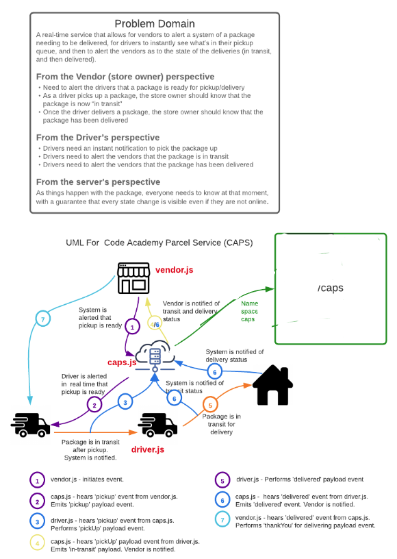

# Lab 12:CAPS-Socket.io (driver.js)
## Authors: Taylor Thornton & Clement Buchanan

This element of our socket.io API acts as a client to the /caps namespace created in the caps.js app.  In this file, we bring in socket.io-client as well as a declared host.  For this case we are using 'http://localhost:3000'.  We then make a connection to the caps name space. Client listens for `'pickup'` and `'in-transit'` events and runs code accordingly.  Client emits own events to the caps name space ('in-transit' and 'delivered'). 

## Setup
- npm init
- Install dependencies: faker.js, socket.io@2, socket.io-client@2, dotenv
- in your local environment, create a .env to declare PORT and STORE_NAME

## Returns Object (Sample)
- logs pick up and delivered message
- SAMPLE:

`DRIVER: picked up 20588
DRIVER: delivered 20588
DRIVER: picked up 48280
DRIVER: delivered 48280`

## Tests (in progress)
- Unit tests: npm run test

## UML

